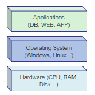
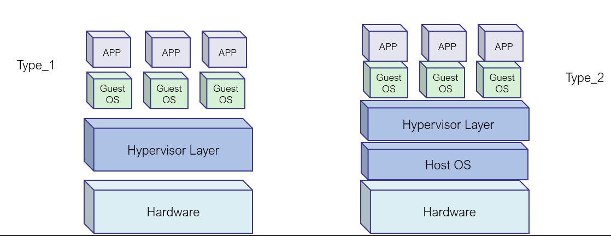

# Why Docker? | Tại sao lại là docker?

### Sơ lược về mô hình ứng dụng truyền thống | 
Monolithic application

- **Ưu điểm:** Dễ dàng phát triển, triển khai ban đầu, kiểm thử.
- **Nhược điểm:**
    - 1/ Không có tính linh hoạt để mở rộng, thu hẹp quy mô khi có nhu cầu (
        - Ví dụ 1: khi tải của ứng dụng cao (high workload) thì đòi hỏi ứng phải thêm máy chủ, thêm CPU, RAM...(hardware) 
        - Ví dụ 2: khi muốn triển khai tính năng mới của phần mềm cần kiểm thử các tính năng (function) sẽ gặp nhiều khó khăn với những ứng dụng đang chạy chịu tải (product env).
    - 2/ Chính vì khó để cập nhật tính năng mới nên sẽ khó để bắt kịp các xu hướng phát triển phần mềm mới, công nghệ mới
    - 3/ Các thành phần của ứng dụng bị tách biệt và cô lập và phụ thuộc lẫn nhau (ví dụ: web, app, database) 
Mô hình Monolithich Application chủ yếu được chạy trên các hạ tầng truyền thống hoặc ảo hóa có mô tả như 2 hình sau:
- Mô hình hạ tầng truyền thống
    
- Bao gồm máy chủ vật lý có CPU, RAM, DISK
- Mô hình hạ tầng ảo hóa
    
[nguồn - https://opensourceforu.com/2018/06/how-docker-differs-from-a-virtual-machine/](https://opensourceforu.com/2018/06/how-docker-differs-from-a-virtual-machine/)

### Mô hình triển khai ứng dụng phân tán

- Micro-service application ra đời để giảm thiểu các nhược điểm mà mô hình monolithic đang tồn tại
- **Ưu điểm:** 
    - Dễ dàng mở rộng cũng như thu hẹp ứng dụng/dịch vụ
    - Các khối dịch vụ được phát triển độc lập nhưng kết nối một cách linh hoạt (giữa các service) do đó dễ dàng tích hợp công nghệ mới khi có nhu cầu
    - Dễ sử dụng đối với các nhà phát triển mà không phụ thuộc vào hạ tầng phần cứng (Hardware)
- **Nhược điểm:** 
    - Khó bảo trì, vận hành
    - Mỗi dịch vụ (service) đều yêu cầu các thành phần và môi trường riêng biệt do đó cần được vận dụng một cách linh hoạt
- Các thành phần của microservice được mô tả như hình trên
    - Bao gồm các lớp ứng dụng độc lập (service layer)
    - Lớp kết nối các ứng dụng độc lập (service broker layer)
    - Lớp ứng dụng đầu cuối (service consumer layer)
- Thành phần cũng như trái tim của micro-service chính là Containers => Chúng được đặt bên trong các máy chủ (hosts)
- Trong các công cụ được quản lý, vận hành Container thì Docker của công ty Docker được biết đến nhiều nhất

- **Docker** ra đời và được biết đến như công cụ dùng để phát triển phần mềm nhằm một phần đưa việc phát triển phần mềm theo dạng micro-services, giảm thiểu các yếu nhược điểm còn tồn tại trong mô hình ứng dụng monolithic, giảm lệ thuộc vào hạ tầng truyền thống. Được phát triển bởi công ty Docker.
### Vì sao lại là Docker
[Nguồn https://www.docker.com/why-docker](https://www.docker.com/why-docker)

- Docker là một phần từ dự án open-source Moby on Github [Link](https://github.com/moby)
- Docker được phát triển và bảo trì bởi công ty Docker
- Tên ban đầu là dotCloud.

### Các thông tin về phiên bản Docker 
- Docker Community Edition (CE): Free
- Docker Enterprise Edition (EE): Commercial
- Các phiên bản:
    - Trước Q1, 2017: major.minor.patch.
    - Sau Q1, 2017: YY.MM.xx.

#### Tổ chức Open Container Initiative (OCI) 
Ra đời nhằm mục đích chuẩn hóa các thành phần bên trong container bao gồm tiêu chuẩn của image và container runtime. Tổ chức này bao gồm Docker và CoreOS chủ yếu xây dựng.
bài tiếp theo: tìm hiểu về Linux Container và Docker Container Runtime [Link](./container.md)